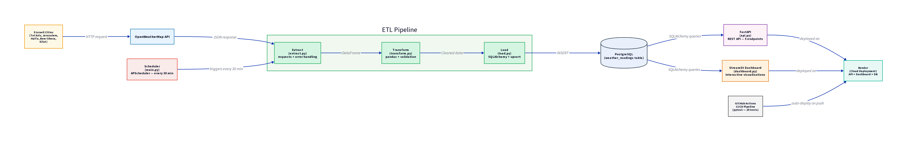

Weather Data Pipeline

A full-stack **ETL (Extract, Transform, Load) data pipeline** that fetches real-time weather data for 5 Israeli cities from the OpenWeatherMap API, processes it with pandas, stores it in a PostgreSQL database, and exposes it via a FastAPI REST API and an interactive Streamlit dashboard.

Built as a portfolio project to demonstrate end-to-end data engineering skills.

---

## Features

- **Extract:** Fetches live weather data from OpenWeatherMap API with robust error handling (timeouts, HTTP errors, connection errors)
- **Transform:** Processes raw data with pandas, adds calculated fields (`temp_diff`, `temp_category`)
- **Load:** Saves data to both PostgreSQL (primary) and CSV (backup)
- **REST API:** 6 FastAPI endpoints with Swagger documentation at `/docs`
- **Dashboard:** Interactive Streamlit dashboard with Plotly charts, filters, and live pipeline trigger
- **Scheduler:** Automated pipeline runs every N hours using the `schedule` library
- **Testing:** 25 pytest tests across 3 test files (API, transform, extract)
- **Docker:** Full containerization with 3-service docker-compose (API + DB + Dashboard)
- **CI/CD:** GitHub Actions runs tests on every push to main

---

## Project Structure
Data-Pipeline-Project/
├── src/
│   ├── main.py          # Entry point — runs pipeline once or starts scheduler
│   ├── config.py        # Configuration and environment variables
│   ├── extract.py       # Fetches weather data from OpenWeatherMap API
│   ├── transform.py     # Processes and enriches data with pandas
│   ├── load.py          # Saves data to PostgreSQL and CSV
│   ├── database.py      # Database connection and table setup (SQLAlchemy)
│   ├── scheduler.py     # Automated scheduling (every N hours)
│   ├── api.py           # FastAPI REST API (6 endpoints)
│   ├── schemas.py       # Pydantic response models
│   ├── dashboard.py     # Streamlit interactive dashboard
│   └── tests/
│       ├── conftest.py       # pytest configuration
│       ├── test_api.py       # 12 tests for API endpoints
│       ├── test_transform.py # 7 tests for data processing
│       └── test_extract.py   # 6 tests for data fetching (with mocks)
├── .github/
│   └── workflows/
│       └── deploy.yml   # CI/CD: test on push, deploy to Render
├── Dockerfile           # Python app container image
├── docker-compose.yml   # 3-service stack (API + DB + Dashboard)
├── .dockerignore        # Excludes unnecessary files from Docker build
├── render.yaml          # Render Blueprint for cloud deployment
├── .env.example         # Template for environment variables
├── .gitignore
├── requirements.txt
└── README.md

---

## Architecture



*Full ETL pipeline: OpenWeatherMap → Extract → Transform → Load → PostgreSQL → FastAPI / Streamlit → Render*

---

## Tech Stack

| Tool | Purpose |
|---|---|
| Python 3.13 | Core language |
| requests | HTTP client for OpenWeatherMap API |
| pandas | Data processing and transformation |
| PostgreSQL 18 | Persistent data storage |
| SQLAlchemy + psycopg2 | Python ↔ Database connection |
| schedule | Task scheduling (Windows-compatible) |
| FastAPI + uvicorn | REST API server |
| Pydantic | Data validation and serialization |
| Streamlit + Plotly | Interactive dashboard and charts |
| pytest + httpx | Testing (25 tests) |
| Docker + docker-compose | Containerization (3 services) |
| GitHub Actions | CI/CD pipeline |
| Render | Cloud deployment |

---

## Quick Start

### Local Setup
```bash
# Clone and enter the project
git clone https://github.com/ibrahem22-dev/Data-Pipeline-Project-
cd Data-Pipeline-Project-

# Create virtual environment
python -m venv venv
venv\Scripts\activate  # Windows

# Install dependencies
pip install -r requirements.txt

# Configure environment
copy .env.example .env
# Edit .env: add your API key and database credentials

# Create PostgreSQL database
psql -U postgres -c "CREATE DATABASE weather_pipeline;"

# Run the pipeline
cd src
python main.py
```

### Docker Setup (recommended)
```bash
docker-compose up --build
```

This starts 3 services:
- **API:** `http://localhost:8000` (Swagger docs at `/docs`)
- **Dashboard:** `http://localhost:8501`
- **PostgreSQL:** `localhost:5432`

---

## Usage

### Run the pipeline once
```bash
cd src && python main.py
```

### Start the scheduler (every 6 hours)
```bash
cd src && python main.py --schedule
```

### Custom interval (every 2 hours)
```bash
cd src && python main.py --schedule --hours 2
```

### Start the API server
```bash
cd src && uvicorn api:app --reload
```

### Start the dashboard
```bash
cd src && streamlit run dashboard.py
```

---

## API Endpoints

| Method | Path | Description |
|---|---|---|
| GET | `/` | API info and endpoint list |
| GET | `/weather` | All readings (with `limit`/`offset` pagination) |
| GET | `/weather/stats` | Aggregated stats per city |
| GET | `/weather/latest` | Latest reading per city |
| GET | `/weather/{city}` | Readings for a specific city (case-insensitive) |
| POST | `/weather/fetch` | Manually trigger the ETL pipeline |

---

## Running Tests
```bash
cd src && pytest tests/ -v
```

25 tests covering:
- All 6 API endpoints (success, failure, edge cases)
- Data transformation (calculated columns, empty input)
- Data extraction (mocked API responses, error handling)

---

## Cities Tracked

| City | Region | Climate |
|---|---|---|
| Nazareth | Northern Israel | Continental |
| Tel Aviv | Central coast | Mediterranean |
| Haifa | Northern coast | Coastal |
| Jerusalem | Central highlands | Mountain |
| Beer Sheva | Southern desert | Arid |

---

## Project Status

- [x] API data fetching with error handling
- [x] Data processing with pandas
- [x] CSV export (backup)
- [x] PostgreSQL storage
- [x] Scheduled automation
- [x] FastAPI REST API (6 endpoints + Swagger)
- [x] Testing (pytest — 25 tests)
- [x] Streamlit dashboard
- [x] Docker containerization (3 services)
- [x] CI/CD (GitHub Actions)
- [x] Cloud deployment config (Render)

---

## Author

**Ibrahim Abu Nasser** — CS & Math student
GitHub: [@ibrahem22-dev](https://github.com/ibrahem22-dev)
